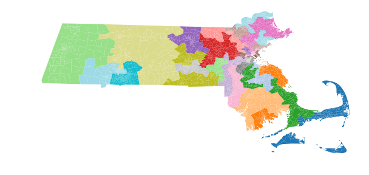

# Using `maup` to use a real-life plan in GerryChain

To generate an ensemble of districting plans using GerryChain, we need a
starting point for our Markov chain. GerryChain gives you functions like
`recursive_tree_part` to generate such plans from scratch, but you may want to
use an actual districting plan from the real world instead. You also may want to
compare a real-life plan to your ensemble.

[`maup`](https://github.com/mggg/maup) is MGGG's package for doing common
spatial data operations with redistricting data. We'll use this package to
assign our basic geographic units to the districts in the plan we're interested
in. Our steps are:

-   Download a Shapefile of the districting plan we're interested in,
-   Use `maup` to assign the our basic units to the districts in that plan, and
    then
-   Create a GerryChain Partition using that assignment.

```python
>>> import maup
>>> import geopandas
>>> import matplotlib.pyplot as plt
```

## Downloading a plan

For this guide, we'll assign Massachusetts's block groups to the 2010
Massachusetts State Senate districting plan. We can use
[geopandas](https://geopandas.org) to download this Shapefile straight from the
TIGER/Line files on the U.S. Census Bureau's website:

```python
>>> districts = geopandas.read_file("https://www2.census.gov/geo/tiger/TIGER2012/SLDU/tl_2012_25_sldu.zip")
```

## Getting the assignment

Now we can use `maup` to assign our units to districts. See
[the `maup` documentation](https://github.com/mggg/maup/blob/master/README.md#assigning-precincts-to-districts)
for another example and more information.

First we'll load our units as a GeoDataFrame:

```python
>>> units = geopandas.read_file("zip://./BG25.zip")
```

Now we'll use `maup.assign` to get an assignment from units to districts:

```python
>>> assignment = maup.assign(units, districts)
---------------------------------------------------------------------------

TypeError                                 Traceback (most recent call last)

<ipython-input-4-23d58953eccb> in <module>
----> 1 assignment = maup.assign(units, districts)


crs.py in wrapped(*args, **kwargs)
      9             raise TypeError(
     10                 "the source and target geometries must have the same CRS. {} {}".format(
---> 11                     geoms1.crs, geoms2.crs
     12                 )
     13             )


TypeError: the source and target geometries must have the same CRS. {'proj': 'aea', 'lat_1': 29.5, 'lat_2': 45.5,'lat_0': 37.5, 'lon_0': -96, 'x_0': 0, 'y_0': 0, 'ellps': 'GRS80', 'units': 'm', 'no_defs': True} {'init':'epsg:4269'}
```

Oh no! ❌ This error is telling us that the coordinates in our `units` and our
`districts` are stored in different coordinate reference systems (different
projections). We can fix this by setting the `units` CRS to match the
`districts` CRS:

```python
>>> units.to_crs(districts.crs, inplace=True)
```

Now let's try again:

```python
>>> assignment = maup.assign(units, districts)
```

Yay! 🎉 It worked!

Let's use the [pandas](http://pandas.pydata.org/) `.isna()` method to see if we
have any units that could not be assigned to districts:

```python
>>> assignment.isna().sum()
0
```

This means that every unit was successfully assigned. If our basic units were
too large to get a meaningful assignment, or if the districts did not cover all
of our units (e.g. if our units included parts of the Atlantic Ocean but the
districts did not), then we would have units with NA assignments that we would
need to make decisions about.

We'll save the assignment in a column of our `units` GeoDataFrame:

```python
>>> units["SENDIST"] = assignment
```

## Creating a `Partition` with the real-life assignment

Now we are ready to use this assignment in GerryChain. We'll start by loading in
our Graph from a pre-saved JSON file:

```python
>>> from gerrychain import Graph, Partition
>>> graph = Graph.from_json("./Block_Groups/BG25.json")
```

In order to get this assignment onto the graph, we need to match the nodes of
our graph to the geometries in `units` by their GEOIDs. We can use the `graph`
object's `.join()` method to do this matching automatically:

```python
>>> graph.join(units, columns=["SENDIST"], left_index="GEOID10", right_index="GEOID10")
```

The `left_index` and `right_index` arguments tell the `.join()` method to use
the `GEOID10` node attribute and the `GEOID10` column of `units` to match the
records in `units` to the nodes of our graph.

Now `graph` has a node attribute called `SENDIST` that we can use to create a
Partition:

```python
>>> real_life_plan = Partition(graph, "SENDIST")
```

To check our work, let's plot the `real_life_plan` using the Partition's
`.plot()` method:

```python
>>> real_life_plan.plot(units, figsize=(10, 10), cmap="tab20")
>>> plt.axis('off')
>>> plt.show()
```



That looks like a districting plan! Woohoo! 🎉🎉🎉

### Troubleshooting possible issues

If the plan looked like random noise or confetti, then we might suspect that
something had gone wrong. The two places we would want to look for problems
would be:

-   the `graph.join` call, which would go wrong if the GEOIDs did not match up
    correctly, or
-   the final `real_life_plan.plot` call, which would go wrong if the
    GeoDataFrame's index did not match the node IDs of our graph in the right
    way.

We could inspect both issues by making sure that the records with matching IDs
actually referred to the same block groups.

You also might run into problems when you go to run a Markov chain using the
partition we made. If the districts are not contiguous with respect to your
underlying graph, you would want to add edges (within reason) to make the graph
agree with the notion of contiguity that the real-life plan uses. See [What to
do about islands and connectivity](What to do about islands and connectivity)
for a guide to handling those types of issues.
